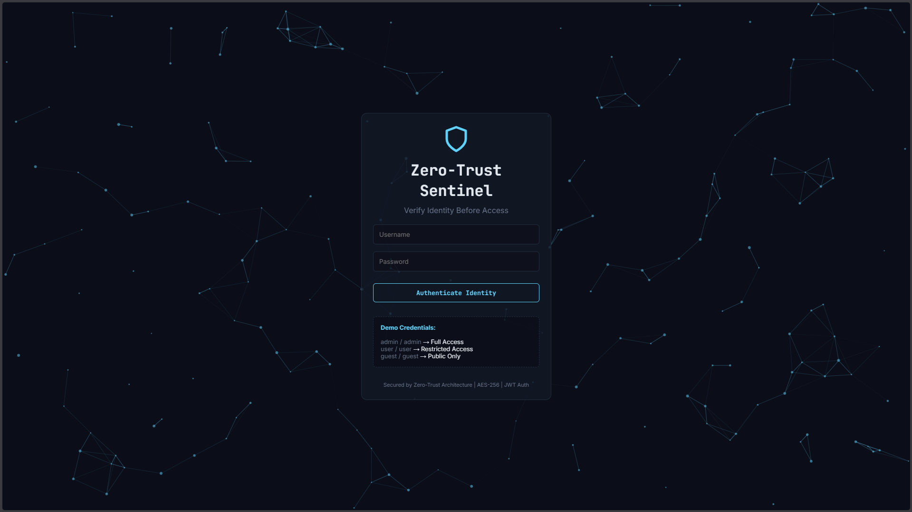
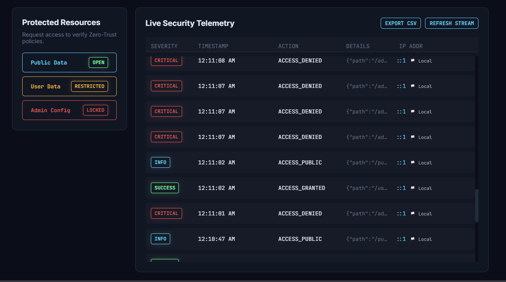
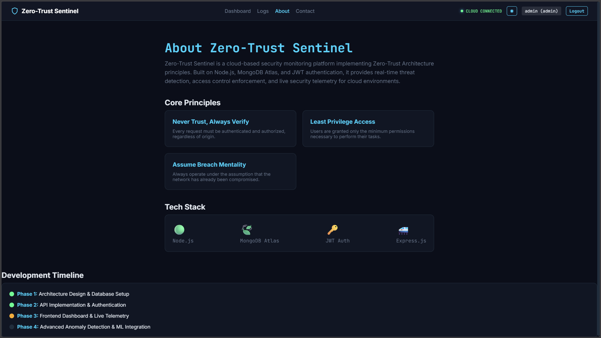
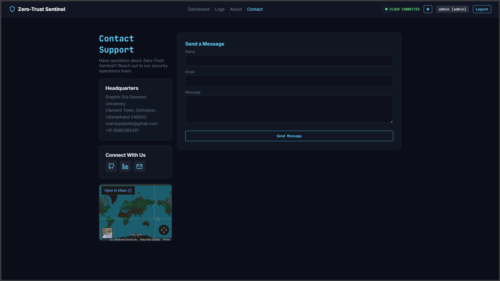

# Zero-Trust Cloud Security Platform

A "Cloud-Native" security monitoring platform demonstrating "Never Trust, Always Verify" principles. This project features a professional Glassmorphism UI and a cloud-backed architecture using MongoDB.

## 🚀 Enterprise Features
- **Cloud-Native Logging**: Centralized telemetry handling via **MongoDB Atlas**, structured for SIEM integration.
- **Premium Security Console**:
    - **Glassmorphism UI**: High-end aesthetic with frosted glass effects and deep-space theme.
    - **Real-Time Telemetry**: Live streaming of security events with severity classification.
    - **Visual Analytics**: Instant stats on blocked vs. successful access attempts.
- **Zero-Trust Policy Engine**:
    - Context-aware access control (IP, Time, Role).
    - Dynamic anomaly detection (e.g., rapid failures trigger CRITICAL alerts).
- **Identity & Access**: JWT-based authentication with strict RBAC enforcement.

## 📂 Project Structure
```
Zero Trust/
├── data/
│   └── users.json       # Mock Identity Provider
├── middleware/
│   ├── auth.js          # JWT Verification
│   ├── policy.js        # Zero-Trust Enforcement
│   └── logging.js       # Cloud Logger (MongoDB)
├── models/
│   └── Log.js           # Mongoose Data Model
├── public/
│   ├── index.html       # Dashboard Structure
│   ├── style.css        # Glassmorphism Design System
│   └── script.js        # Frontend Logic
├── routes/              # API Endpoints
└── server.js            # API Gateway & Server
```

## 📸 Screenshots

### 🔐 Login
<p align="center">
  
</p>

### 📊 Dashboard
<p align="center">
  
</p>

### 📜 Logs Monitoring
<p align="center">
  
</p>

### ℹ️ About
<p align="center">
  
</p>

### 📞 Contact
<p align="center">
  
</p>

## 🛠️ Setup & Cloud Integration

1.  **Install Dependencies**:
    ```bash
    npm install
    ```

2.  **Configure Environment**:
    - Create a `.env` file (see `.env.example`).
    - Add your **MongoDB Connection URI**.
    - *Note: If no URI is provided, it attempts to connect to a local MongoDB instance.*

3.  **Start the Platform**:
    ```bash
    node server.js
    ```

4.  **Launch the Console**:
    Open [http://localhost:3000](http://localhost:3000) to access the Zero-Trust Sentinel Dashboard.

## 🧪 Simulation Scenarios

1.  **Authorized Access**:
    - Login as `admin` / `adminpassword`.
    - Access **Admin Config** to see a "SUCCESS" log entry.
2.  **Zero-Trust Blocking**:
    - Login as `user`.
    - Attempt to access **Admin Config**.
    - Watch the **Live Telemetry** stream instantly show a red **CRITICAL** alert for insufficient permissions.
3.  **Anomaly Detection**:
    - Aggressively click "Access Public Data" to generate traffic.
    - Observe the logs populating in real-time.
